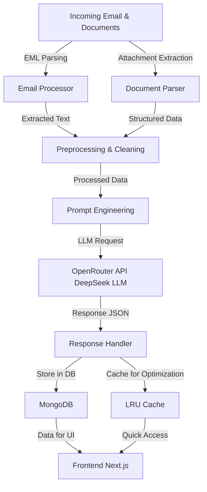

# 🏗️ Architecture Overview

## 🦅 High-Level System Architecture  

### Architecture Image 

## 📌 Overview  
The **Gen AI Orchestrator** is a robust and scalable system designed to automate email and document processing using **LLMs (DeepSeek via OpenRouter API)**. It integrates **email parsing, document extraction, AI-driven classification, and an optimized caching strategy** to enhance performance and efficiency.  

The system is composed of the following key components:  

### 1️⃣ **Email & Document Processing**
- Extracts email headers, body, and attachments (PDF, Word, Excel).  
- Uses a structured pipeline to clean and preprocess data before AI processing.  

### 2️⃣ **AI-Powered Classification & Extraction**
- Uses **Prompt Engineering** to structure the input before sending it to **DeepSeek via OpenRouter API**.  
- Retrieves structured JSON responses containing **summaries, extracted fields, request types, and confidence scores**.  

### 3️⃣ **Database Storage & Caching**
- Stores structured data in **MongoDB** for historical access and analytics.  
- Implements **LRU Caching** to speed up frequently requested data retrieval.  

### 4️⃣ **Frontend (Next.js)**
- Provides an intuitive UI for users to **upload, view, and interact with processed results**.  
- Fetches real-time data from the backend and displays structured insights.  

---

## 📊 System Workflow  

### 🔹 **Step 1: Email & Document Ingestion**
- The system receives an **email (EML format) or a document** (PDF, Word, Excel).  
- The **Email Processor** extracts metadata, headers, and the main body.  
- Attachments are passed to the **Document Parser** for content extraction.  

### 🔹 **Step 2: Data Cleaning & Preprocessing**
- Extracted text is cleaned, normalized, and formatted.  
- Relevant fields such as **loan amount, expiration date, client name, and request type** are identified.  

### 🔹 **Step 3: AI Processing via OpenRouter API**
- The processed data is **formatted into a structured prompt**.  
- The API call is made to **DeepSeek via OpenRouter**, which returns a JSON response.  
- The response includes:
  - **Primary Intent** (e.g., Fee Payment, Commitment Change).  
  - **Key Details** (e.g., deal name, amount, dates).  
  - **Request Type with Confidence Scores**.  

### 🔹 **Step 4: Response Handling & Storage**
- The AI-generated response is **parsed and stored** in MongoDB.  
- Frequently accessed results are cached using **LRU caching** for faster retrieval.  

### 🔹 **Step 5: UI Display & Interaction**
- The **Next.js frontend** fetches results and displays them in an **interactive dashboard**.  
- Users can:
  - **View Request Type , Sub Request type**.  
  - **LLM's extracted fields form Attachment and Emial Body**.  
  - **Primary Intent of the Email**.
  - **Summary of the Email**.

---

## 🚀 Key Optimizations  

### 🏎️ **LRU Caching**
- Implements an **LRU (Least Recently Used) cache** to **speed up data access** and **reduce redundant API calls**.  
- Ensures **quick response times** for frequently processed emails/documents.  

### 🤖 **Advanced Prompt Engineering**
- Carefully designed **AI prompts** to enhance **DeepSeek’s accuracy**.
- Customizable Request type and sub request type definitions at runtime.
- Optimized for **structured output**, minimizing post-processing efforts.  

### 🔥 **Scalable Storage with MongoDB**
- Stores extracted data in a **NoSQL database**, allowing **flexible queries and fast retrieval**.  

---

## 🔮 Future Enhancements  
✅ **Automated Feedback Loops** – Improves AI accuracy over time.  
✅ **Real-Time Event Streaming** – Adds Kafka for event-driven processing.  
✅ **Redis Integration** – Enhances caching with a distributed memory store.  
✅ **Multi-Language Support** – Extends AI processing for multilingual emails.  

🚀 **This system combines AI, caching, and scalable storage to revolutionize email and document processing for financial workflows.** 🚀  

